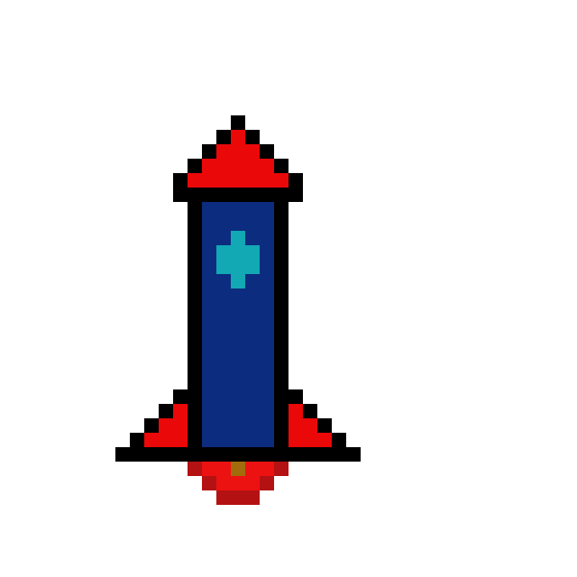

# Desafio DIO - Criando o Primeiro Repositório

- Olá eu sou o Erick!
- Sou Graduado em Gestão em Tecnologia da Informação
- Pós Graduado em Engenharia da Qualidade de Software

## O que eu mais gosto de fazer?

1. Aprender Novas Tecnologias
2. Games
3. Artes
4. Ler Artigos

## Veja algumas artes digitais que eu já criei:

